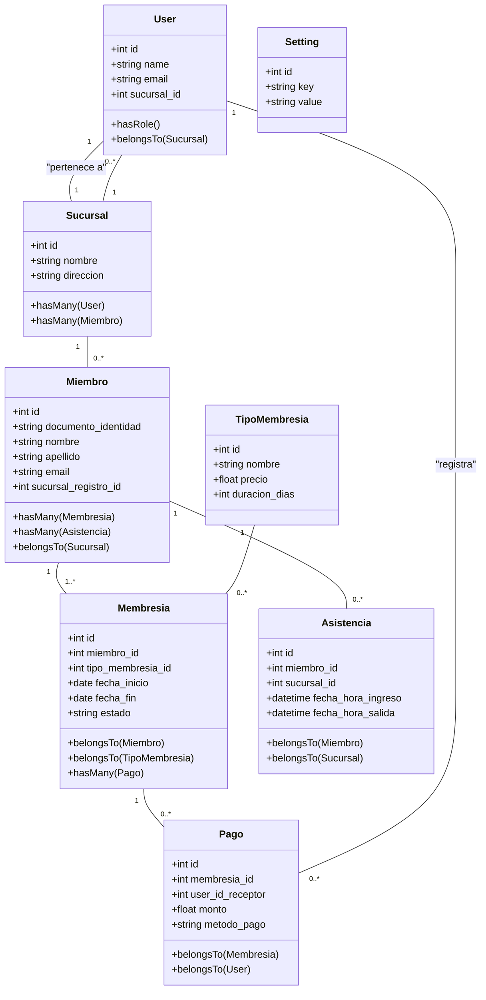

# Diagrama de Clases y Diseño Preliminar

Este documento describe la arquitectura de la base de datos a través de un diagrama de clases y una descripción detallada de los modelos Eloquent.

## 1. Diagrama de Clases (Mermaid)

## 2. Descripción de Modelos Eloquent

### User
- Representa a los empleados del gimnasio (Administrador, Recepcionista).
- Utiliza `spatie/laravel-permission` para roles.

### Sucursal
- Representa una de las ubicaciones físicas del gimnasio.

### Miembro
- Representa a los clientes del gimnasio. El `documento_identidad` es su clave.

### TipoMembresia
- Define los planes que ofrece el gimnasio (ej. Mensual, Anual).

### Membresia
- La suscripción de un `Miembro` a un `TipoMembresia`.

### Pago
- Registra cada pago realizado para una `Membresia`.

### Asistencia
- Registra cada ingreso y salida de un `Miembro`.

### Setting
- Almacena la configuración global de la aplicación en formato clave-valor (ej. tema, logo, nombre de la app).
