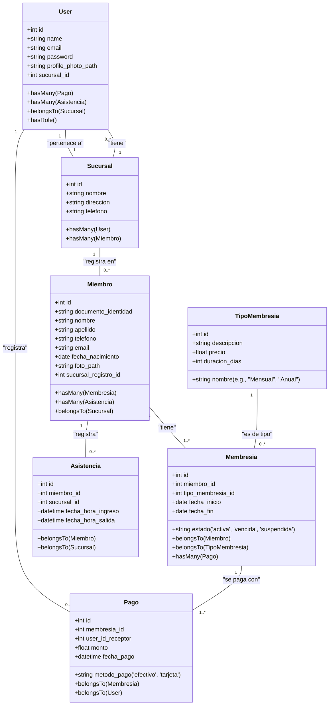

# Diagrama de Clases y Diseño Preliminar

Este documento describe la arquitectura de la base de datos a través de un diagrama de clases y una descripción detallada de los modelos Eloquent.

## 1. Diagrama de Clases (Mermaid)

## 2. Descripción de Modelos Eloquent

### User
- Representa a los empleados del gimnasio (Administrador, Recepcionista).
- Se relaciona con `Sucursal` para saber a qué sucursal pertenece el empleado.
- Utiliza `spatie/laravel-permission` para la gestión de roles.
- Registra los `Pagos` que recibe.

### Sucursal
- Representa una de las ubicaciones físicas del gimnasio.
- Contiene usuarios (empleados) y miembros registrados en esa sucursal.

### Miembro
- La tabla central, representa a los clientes del gimnasio.
- El `documento_identidad` es su identificador único para el acceso.
- Tiene un historial de `Membresias`.
- Se registra en una sucursal principal (`sucursal_registro_id`) pero puede tener `Asistencia` en cualquiera.

### TipoMembresia
- Define los planes que ofrece el gimnasio (ej. Mensual, Trimestral, Anual).
- Contiene el precio y la duración de cada tipo de membresía.

### Membresia
- Representa la suscripción de un `Miembro` a un `TipoMembresia`.
- Tiene una fecha de inicio, fin y un estado para controlar el acceso.

### Pago
- Registra cada pago realizado para una `Membresia`.
- Guarda quién (`User`) recibió el pago.

### Asistencia
- Registra cada ingreso y salida de un `Miembro` en una `Sucursal`.
- Permite el control de acceso y genera reportes de afluencia.
